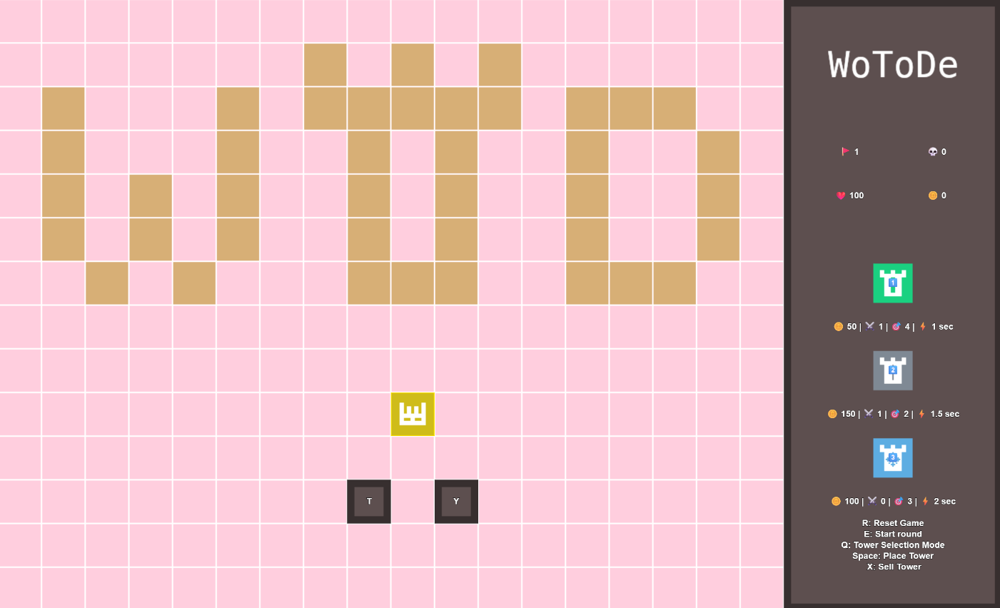
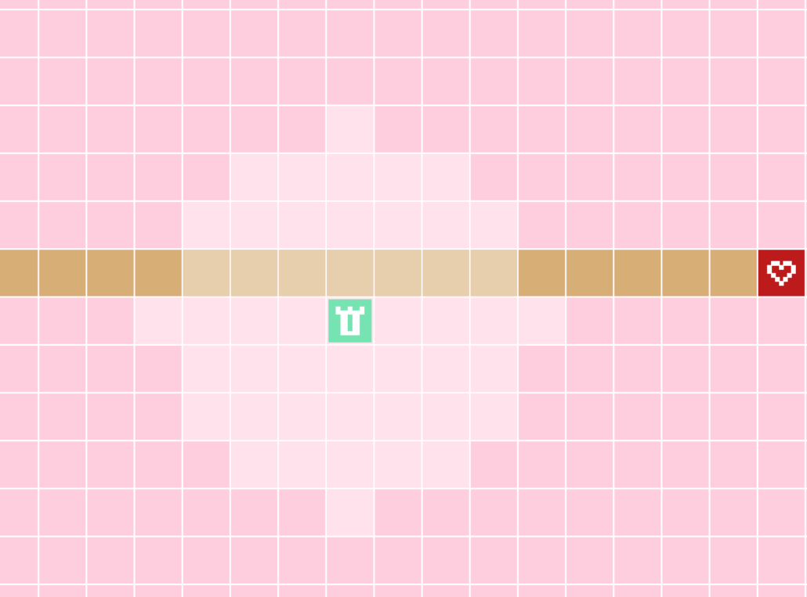
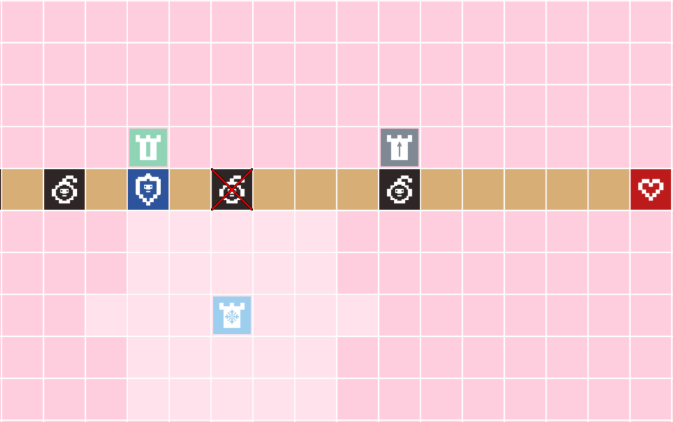
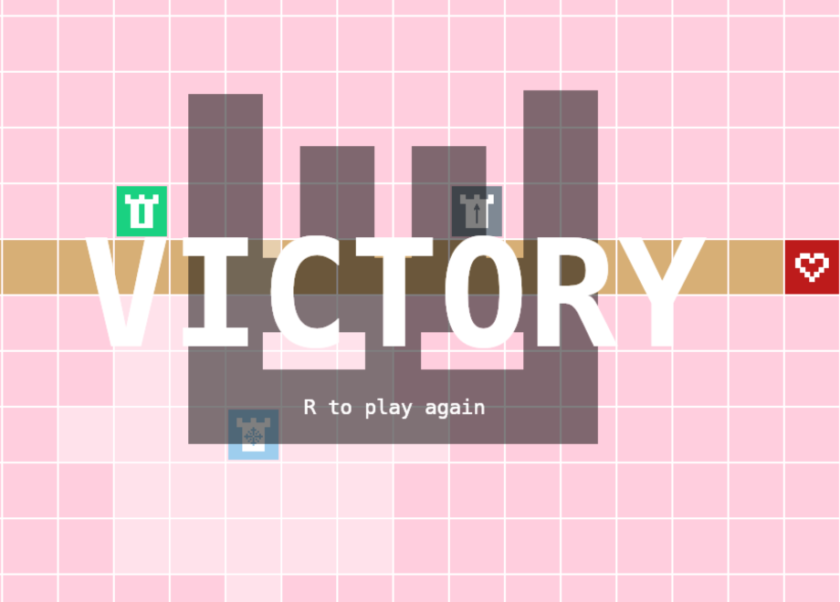

UTN - Facultad Regional Buenos Aires - Materia Paradigmas de Programación

## Equipo de desarrollo:

- Arellano, Ariel Iván
- Davenheimer, Emerson Javier
- Di Bennardo, Juan Ignacio
- Porzolis Requena, Alexis Eduardo

## Introducción

WoToDe es un juego de tipo tower defense, él cual consiste en defender nuestro núcleo vital de los enemigos que buscan destruirlo, para ello podemos crear torres, con distintos efectos, para cubrir nuestra razón de existir.

## Capturas
*Pantalla principal*

*Etapa de construcción*

*Enemigos en acción*

*Interacción enemigos-torres*

*¡Victoria!*

## Reglas de Juego / Instrucciones

### Instrucciones del juego
> Una vez iniciado WoToDe, el jugador se encontrará en la página principal, dónde debe escoger el nivel que desea jugar. A partir de allí, se encontrará con las siguientes fases:
>
>> **Fase de selección de nivel**: debe presionar la tecla del nivel que quiere jugar.
>
>> **Fase de construcción**: puede colocar tantas torres según la cantidad de monedas que disponga (puede ver el costo de cada torre en el menú lateral).
>
>> **Fase de ejecución de ronda**: los enemigos avanzarán por el camino marcado con el objetivo de llegar al núcleo.
>
>> **Fase fin de ronda**: cada vez que finalice una ronda, el jugador recibirá oro para poder seguir construyendo más torres.

### Tipos de enemigos
 Enemigo común I: puede recibir daño de cualquier torre.

 Enemigo común II: puede recibir daño de cualquier torre.

 Enemigo común III: puede recibir daño de cualquier torre.

 Enemigo común IV: puede recibir daño de cualquier torre.

 Enemigo con armadura: únicamente la torre perforante le puede hacer daño.

 Enemigo explosivo: al ser destruido explota y hace daño en área a los demás enemigos.

### Tipos de torres
 Torre básica: hace daño a los enemigos comunes.

 Torre ralentizante: ralentiza al enemigo atacado.

 Torre perforante: es la única que puede hacer daño a los enemigos con armadura.

### Controles:

| Tecla  | Acción |
| ------------- |:-------------:|
| W-A-S-D      | Movimientos del personaje     |
| Q     |  Ver rango de las torres    |
| 1     |  Cambiar vista a torre básica |
| 2      |  Cambiar vista a torre ralentizante |
| 3      |  Cambiar vista a torre perforante |
| Espacio      | Costruir torre |
| S      | Vender torre  |
| E      | Iniciar o avanzar una ronda |
| R      | Reiniciar el juego  |

### Consultas 
>> **¿Cómo construyo las torres?**
>>Primero debe presionar la tecla "Q", luego seleccionar la torre que quiere colocar (Tecla #1, #2 o #3) y finalmente tocar la tecla de "Espacio" para confirmar la construcción.
>
>> **¿Cómo ganar?**
>> Pasar todas las rondas antes de que el nucleo se quede sin vida.
>
>> **¿Puedo seguir construyendo torres mientras aparecen los enemigos?**
>> Si.

## Explicaciones teóricas y diagramas

- [Aplicación de conceptos teóricos](./aplicacionTeorica.md)

