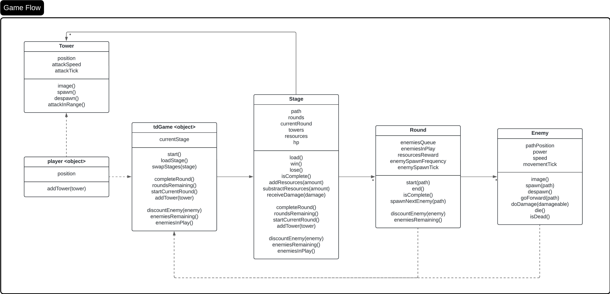
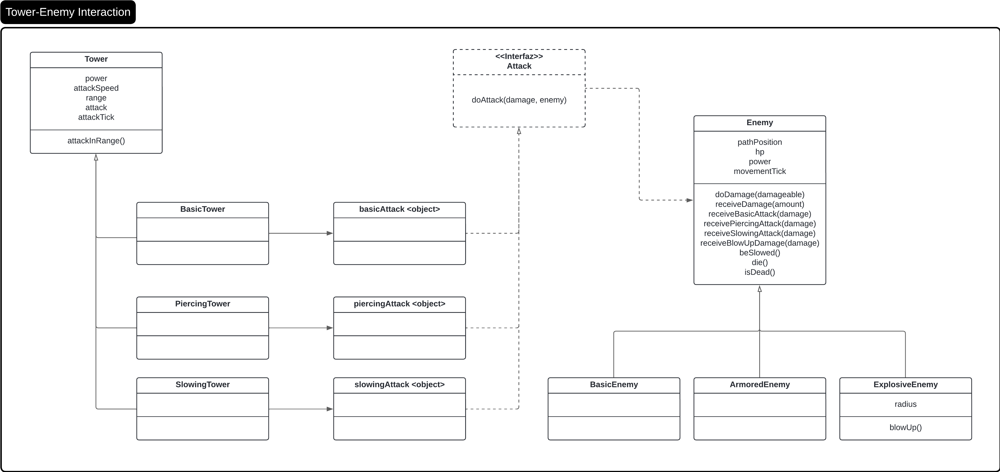

# <span style="color:HotPink">Aplicación teórica</span>.

**Conceptos del paradigma**
- Diagrama estático
- Objetos vs Clases
- Herencia
- Polimorfismo
- Encapsulamiento
- Responsabilidades / Acoplamiento

## Diagrama estático

*(Imagen 1)*


*(Imagen 2)*

## Objetos
- player
- tdGame
- hud
- basicAttack
- piercingAttack
- slowingAttack

## Clases
- Tower
- Round
- Stage
- Enemy
- Road
- Round

## Subclases
- BasicEnemy
- ArmoredEnemy
- ExplosiveEnemy
- HomeStage

## Interfaz
- Attack


## ¿Dónde se aplicó cada concepto?
### Objetos vs Clases
Los componentes **player** y **tdGame** los creamos como objetos, ya que necesitabamos un tablero, que nos permitiera tener el control de todo lo que sucedía en él, y un jugador para poder incorporar las mecánicas de creación de torres. Así que tener solo una instancia de cada uno que mantuviera su comportamiento durante todo el ciclo del juego resolvía nuestra problematica. 
Mientras que **Round**, **Stage**, **Tower**, **Enemy**, **BasicEnemy**, **ArmoredEnemy** y **ExplosiveEnemy** las hicimos como clases dado que necesitabamos distintas instancias (diferentes comportamientos) de esos componentes para poder darle sentido a nuestro juego. Para que se entienda mejor, en el caso de las torres, queríamos poder crear varios tipos de las mismas, dónde cada una pudiera comportarse de forma distinta (distinto rango y tipo de daño) a pesar de tener la misma estructura base(propiedades) y saber responder a los mismos mensajes. Para las demás clases, se aplicó el mismo razonamiento. 


### Herencia
Creamos las superclases **Enemy** para definir la base de lo que es ser un enemigo. Y luego creamos las clases, aplicando herencia, para tener diversos tipos de enemigos con cualidades únicas. De esa forma evitamos repetir lógica y, además, tenemos más libertad de desarrollar nuevos enemigos.


### Polimorfismo
Aplicamos este concepto de dos maneras distintas:
- A través de una interfaz
En este caso, usamos polimorfimo para poder tener distintos tipos de ataques e, internamente, cada uno haga cosas distintas con lo que tiene a disposición (atributos dependiendo de la torre), pero que mantengan la esencia(un contrato) de realizar daño a un enemigo. Más concretamente, las instancias **basicAttack**, **piercingAttack** y **slowingAttack** saben responder al mensaje de **doDamage(damage, enemy)** que le envía cualquier torre, por más que cada uno resuelve la respuesta de hacer daño de forma distinta.
```
object basicAttack {
  method doAttack(damage, enemy) {
    enemy.receiveBasicAttack(damage)
  }
}
```
```
object piercingAttack {
  method doAttack(damage, enemy) {
    enemy.receivePiercingAttack(damage)
  }
}
```
```
object slowingAttack {
  method doAttack(damage, enemy) {
    enemy.receiveSlowingAttack(damage)
  }
}
```

- A través de la herencia
En este otro caso, se dió más naturalmente el polimorfismo, ya que cuando se instancien las **basicEnemy**, **armoredEnemy** y **explosiveEnemy** heredarán el método **doAttack()** de la super clase **Enemy**. 

### Encapsulamiento
Como queríamos que todas nuestras clases y objetos pudieran ser los únicos en modificar sus atributos, todos cuentan con métodos para que otras clases/componentes les soliciten, a través de mensajes, lo que realmente saben hacer y que se respete la integridad de sus datos. Por ejemplo, de la clase enemigo *(ver imágen 1)* lo que queremos es que sepa responder a los mensajes de mostrar su imagen, aparecer, desaparecer o moverse, pero no queremos que esas mismas instancias modifiquen el comportamiento interno de este enemigo; debe ser suficiente con que responda a lo que sabe hacer o lanzar una excepción en caso de desconocer dicho mensaje.

### Responsabilidades / Acoplamiento
Buscamos que las interacciones entre objetos/clases sean lo menos acoplados posibles. Es decir, que como la torre debe hacerle daño a un enemigo, entonces la torre simplemente tiene el método **doDamage(damage, enemy)** que le pide al enemigo que reciba el daño (**receiveDamager(power)**) correspondiente al daño de la misma. Logrando así, bajo acoplamiento al no modificar directamente la vida del enemigo desde la instancia de la torre.
Lo mismo sucede cuando el **player** quiere poner una torre en una posición específica. Lo que sucede es que éste objeto, usando el método **addTower(tower)** le pide a la torre que aparezca en esa posición enviándole un mensaje **spawn()** a la torre con **tower.spawn()** y ésta se encarga de aparecer, o no. Así cada uno se limita a responder mensajes que entienden y hacer solo sus tareas, sin importar como se resuelva el pedido del otro lado. Esto facilita futuros cambios, como podría ser el cómo aparece la torre; podríamos querer que al aparecer gire 180°.